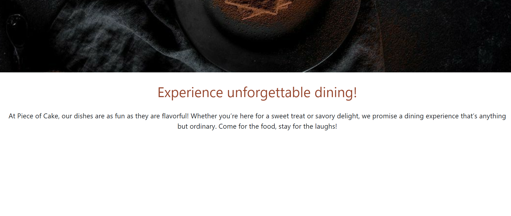
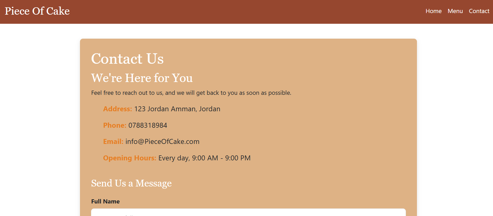
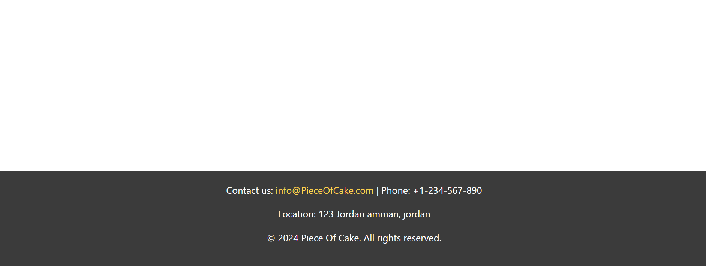

 # Piece of Cake 🍰    

**Piece of Cake** is a responsive restaurant website designed to showcase a delightful dining experience. It features three main pages:    
**Home**, **Menu**, and **Contact**.       
        
## Features     
- **Home Page**: Welcomes visitors with a brief introduction to the restaurant and its specialties.      
- **Menu Page**: Displays a curated list of dishes with descriptions and pricing.      
- **Contact Page**: Includes a form for customers to send inquiries or feedback.       
              
## Technologies Used                     
- **HTML** for structuring content.                 
- **CSS** for styling the website.                 
- **JavaScript** for interactivity and functionality.                
                           
## Live Demo                 
Check out the live website: [Piece of Cake]([https://your-live-url-here.com](https://aseel-alnaami.github.io/FinalJSTask/)                   

                  
 
 
 
 
 
 
 
